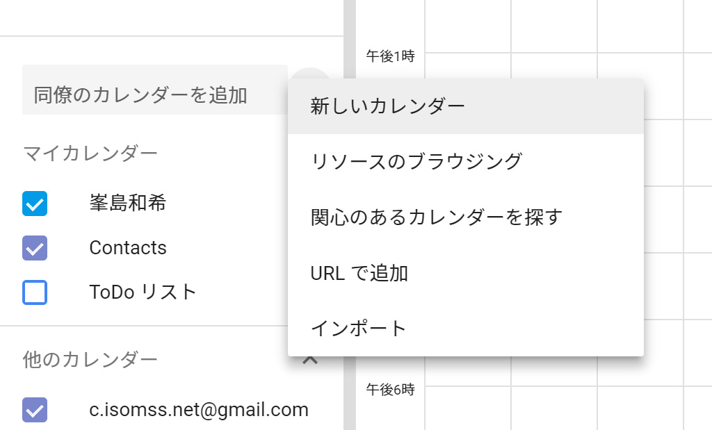
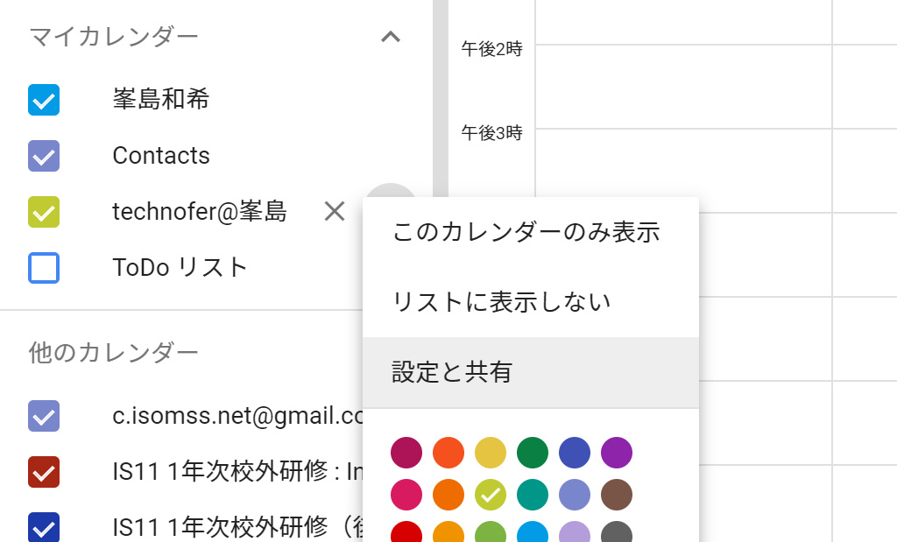
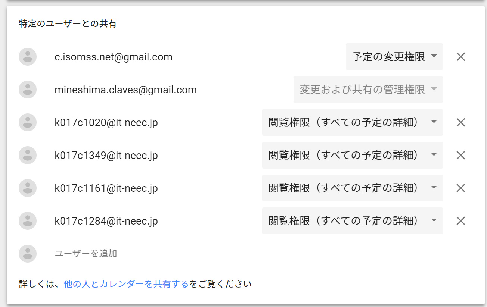

# Slackを導入する

### Slackって何？
Slackは企業向けのコミュニケーションツールです。  
LINE感覚でやり取りができるため、便利です。

### 何のためにこれやるの？
今現在使われているサイボウズライブがサービス終了するから別のツール探す必要があった。  
勤怠連絡などの連絡はもちろん、シフトを入れるようにできるプラグインなどを開発する予定なのでSlack上でシフト関連のすべての操作ができるようになる。

### Slackの導入方法
1. 管理者にメールアドレスを教えてSlackのワークスペースへ招待してもらう。  

2. メールアドレスにSlackからメールが来ているはずなのでリンクをクリックして参加する。

3. 氏名や表示名などの登録ページに飛ぶので入力して「次へ」を押す。  
\* もしかしたら利用規約などの確認ページに飛ぶかもしれないけど気にせず次へ

4. ほかのメンバーを招待するかどうか尋ねられるが、「後で」を押す。

5. Slackのメイン画面が表示されたらSlackへの登録は完了。  
\* メイン画面に行く前にチュートリアルがあるかもしれない  

6. 管理者に`# シフト`チャンネルに招待してもらう。

7. Slackには[デスクトップアプリ](https://slack.com/intl/ja-jp/downloads/windows)やスマートフォン向けアプリ([android](https://play.google.com/store/apps/details?id=com.Slack&hl=en)/[iOS](https://itunes.apple.com/jp/app/slack/id618783545?mt=8))などがあるので、  
自分のpcやスマートフォンにインストールしておく。（任意だけどあると便利だよ）

8. デスクトップアプリやスマートフォン向けアプリでSlackにサインインするとき、最初にワークスペースを聞かれるけど、`technofer`です。

9. 終わり

# それで、どうやってシフト管理するの？
当たり前ですが、Slackはシフト管理するアプリではないので、これ単体では意味がありません。  
SlackとGoogle Calendarを同期させてシフトを管理します。  

必然的にグーグルアカウントが必要になりますが、日本工学院の学生の方は学内メールアドレス(it-neec.jp)で既にグーグルアカウントが作られているのでそれを利用するとよいと思います。  

その他の方は、既存のアカウントを使うかなければ新しく作成してください。

### Google Calendarを作る
1. [Google Calendar](https://calendar.google.com/calendar/)にアクセスする。  

2. 画像を参照して新しいカレンダーを作る。  
カレンダー名は`technofer@[自分の苗字]`にしてください。  
例：technofer@峯島   

3. マイカレンダーに作ったカレンダーが表示されていることを確認してください。

4. 画像を参照して`設定と共有`を開きます。   
  

5. 特定のユーザーとの共有で、カレンダーを共有したい相手のメールアドレスを追加します。   
ここで管理者であるc.isomss.net@gmail.comには`予定の変更権限`を与えます。  
それ以外のユーザーには`閲覧権限（すべての予定の詳細）`を与えてください。  
どのメールアドレスを追加すればよいかは管理者に問い合わせてください。   
以下のようになっていればOKです。   

6. これでGoogle Calendarの作成は終了。

### SlackとGoogle Calendarを同期させる
これでSlackの導入、Google Calendarの作成が終わりました。  
あとは、これらを同期させるだけです。

1. 
